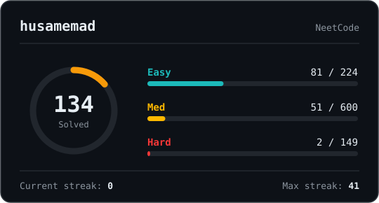

# NeetCode Stats Card



A self-updating stats card for a GitHub profile README that shows your NeetCode
progress: total problems solved, an Easy/Medium/Hard breakdown, and your streak.
A GitHub Actions workflow runs daily, regenerates the SVG, and commits it to the
repo. Your README just points to that file.

This document is both the setup guide **and** the story of how it was built —
what we discovered, what broke, and why each decision was made. If you only want
to deploy it, jump to [Setup](#setup). If you want to understand it, read on.

---

## The goal

Replicate the popular "LeetCode stats card" idea, but for NeetCode:

- A single image URL you drop into your README as ``.
- It reflects your real, current progress.
- It refreshes about once a day.

The catch: unlike LeetCode, **NeetCode has no public profile page and no
documented API.** Everything below is the process of reverse-engineering a way
to get the data anyway, cleanly and reliably.

---

## How the data actually gets collected (the investigation)

### 1. There is no public NeetCode API

LeetCode exposes public profile stats that dozens of open-source "stats card"
projects query. NeetCode does not. Progress lives behind your logged-in account,
so the first job was figuring out *how the site itself* fetches your data, then
replicating exactly that from outside a browser.

### 2. Reading the network traffic (HAR files)

The technique was to capture a **HAR file** — a JSON recording of every network
request the browser makes — while logged into NeetCode, then read through it.

A HAR export from the practice page showed that, past a lot of analytics noise
(PostHog), NeetCode is built on **Firebase**. Nearly all its data comes through a
single endpoint:

```
POST https://neetcode.io/api/callableFunctionHttp
```

This is Firebase's "callable cloud functions" pattern: one URL, and the request
body names which server function to run. The bodies were self-documenting:

| `functionId`            | Returns                                                       |
| ----------------------- | ------------------------------------------------------------ |
| `getCompletedProblems`  | Your solved problems, grouped by topic (as LeetCode URLs)    |
| `getUserStreakData`     | Streak + daily activity heatmap                              |
| `getLeaderboardData`    | A solved-count + percentile (cached/laggy — not used)        |
| `getTopicCounts`        | Total problems per topic across the platform                 |
| `getUserInfo`           | Profile info (also contains sensitive account fields)        |

`getProblemListFunctionHttp` is a separate endpoint returning NeetCode's problem
catalog with difficulty per problem.

### 3. The difficulty problem (and why LeetCode, not NeetCode, provides it)

The card needs an Easy/Medium/Hard split, but `getCompletedProblems` returns only
URLs — no difficulty. The obvious fix was to join against NeetCode's own catalog
(`getProblemListFunctionHttp`), which *does* have difficulty.

It didn't work. NeetCode's catalog uses its **own internal slugs** that differ
from LeetCode's:

- your solved `two-sum` ↔ NeetCode's `two-integer-sum`
- `invert-binary-tree` ↔ `invert-a-binary-tree`
- `contains-duplicate` ↔ `duplicate-integer`

Only 88 of 132 solved problems matched by slug, and the catalog contained **no
LeetCode URL or shared ID** to join on. Internally these are two different
systems: one identifies *NeetCode's page for a problem*, the other identifies
*the canonical LeetCode problem*. Nothing connects them in the data we can see.

**The fix:** skip NeetCode's catalog entirely. `getCompletedProblems` already
gives real LeetCode URLs, so we ask **LeetCode's own public GraphQL API** for
difficulty, keyed by the slug in each URL:

```
POST https://leetcode.com/graphql
{ "operationName": "questionData",
  "variables": { "titleSlug": "reverse-linked-list" },
  "query": "query questionData($titleSlug: String!){ question(titleSlug:$titleSlug){ difficulty } }" }
```

This endpoint needs no authentication. Looping it over all 132 solved slugs
produced **Easy 81 / Medium 50 / Hard 1**, which matches the site's UI exactly.

### 4. The authentication mechanism (the surprising part)

We assumed NeetCode used a session cookie. It doesn't:

- A cookie-export extension came back **empty** for neetcode.io — no cookie at all.
- The tokens live in the browser's **IndexedDB**, in `firebaseLocalStorageDb`,
  because NeetCode uses Firebase Auth's client SDK.

Firebase stores two tokens there:

- **`accessToken`** — a JWT, valid ~1 hour. Sent as `Authorization: Bearer <token>`
  on each API call. (We confirmed this header format with a live call that
  returned HTTP 200 — the "Phase 0" verification step.)
- **`refreshToken`** — long-lived, doesn't expire on a timer. Used to mint new
  access tokens via Google's `securetoken.googleapis.com` endpoint.

This is actually a *better* setup for a background job than a cookie: cookies
expire and can't be renewed headlessly, but a Firebase refresh token is designed
for exactly this. **We store the refresh token once, and the job mints a fresh
access token on every run.**

> ⚠️ **Security note.** The refresh token is equivalent to a password — anyone
> holding it can act as your account. Store it only as an encrypted secret
> (Lambda env var or AWS Secrets Manager). Never commit it, never paste it
> anywhere, and if it's ever exposed, revoke it by removing NeetCode's access at
> https://myaccount.google.com/permissions and signing in again to get a new one.

---

## Architecture

```
   GitHub profile README
     └──▶ card.svg (in this repo)
                  ▲
                  │ commits fresh SVG daily
     ┌────────────┴──────────────┐
     │  GitHub Actions workflow   │
     │  (cron: midnight UTC)      │
     └────────────┬──────────────┘
                  │ pipeline:
                  │  1. refresh token (Google securetoken)
                  │  2. getCompletedProblems (NeetCode, Bearer)
                  │  3. getUserStreakData   (NeetCode, Bearer)
                  │  4. difficulty per slug (LeetCode GraphQL)
                  │  5. build SVG → commit card.svg
```

Every external call in that pipeline was individually tested with a real response
before any deployment code was written.

---

## Project layout

```
neetcode-stats-card/
├── .github/
│   └── workflows/
│       └── refresh.yml  # daily GitHub Actions workflow
├── src/
│   ├── auth.js          # refresh token -> fresh access token (Google securetoken)
│   ├── neetcode.js      # callableFunctionHttp client + response parsing
│   ├── leetcode.js      # per-slug difficulty via LeetCode GraphQL (+ caching, rate-limit)
│   ├── card.js          # SVG generation (main card + error fallback)
│   └── pipeline.js      # chains all of the above into one stats object
├── local.js             # run the pipeline locally, writes card.svg
├── test.js              # offline integration test (mocks network, real pipeline)
├── card.svg             # auto-committed by the workflow — don't edit by hand
├── .difficulty-cache.json
├── package.json
└── README.md
```

---

## Setup

### Prerequisites

- Node.js 18+
- A GitHub account (Actions is free on public repos)
- Your NeetCode Firebase **refresh token** (see below)

### Getting your refresh token

1. Log into neetcode.io.
2. Open DevTools → Console.
3. Run:
   ```javascript
   (async () => {
     const req = indexedDB.open('firebaseLocalStorageDb');
     req.onsuccess = () => {
       const db = req.result;
       const tx = db.transaction(db.objectStoreNames, 'readonly');
       const store = tx.objectStore(db.objectStoreNames[0]);
       const all = store.getAll();
       all.onsuccess = () => {
         const t = all.result[0]?.value?.stsTokenManager?.refreshToken;
         console.log(t);
       };
     };
   })();
   ```
4. Copy the printed value. **Treat it like a password.**

### Phase 1 — run locally first

Always validate locally before deploying:

```bash
npm install
NEETCODE_REFRESH_TOKEN='paste-token' NEETCODE_USERNAME='your name' npm run local
```

This prints your totals and writes `card.svg`. Open it in a browser. The first
run does ~130 LeetCode lookups (about a minute); subsequent runs reuse
`.difficulty-cache.json` and are near-instant.

You can also run the offline test, which exercises the full pipeline against
captured data with the network mocked:

```bash
npm test
```

### Phase 3 — deploy with GitHub Actions

1. **Fork or push this repo to your GitHub account.**

2. **Add your refresh token as a secret:**
   - Go to your repo → **Settings** → **Secrets and variables** → **Actions**
   - Click **New repository secret**
   - Name: `NEETCODE_REFRESH_TOKEN`, value: your token

3. **Edit the username** in `.github/workflows/refresh.yml`:
   ```yaml
   NEETCODE_USERNAME: your name here
   ```

4. **Run the workflow once manually** to generate the initial `card.svg`:
   - Go to **Actions** tab → **Refresh NeetCode Stats Card** → **Run workflow**

5. After it completes, `card.svg` will be committed to your repo.

### Phase 5 — embed in your README

```markdown

```

Push it to your profile repo and confirm it renders.

---

## How the daily refresh works

The workflow in `.github/workflows/refresh.yml` runs every day at midnight UTC.
It executes `npm run local`, which runs the full pipeline and writes a fresh
`card.svg`. If the file changed, it commits and pushes it automatically.

To trigger a refresh manually outside the schedule:
- Go to **Actions** → **Refresh NeetCode Stats Card** → **Run workflow**

The `.difficulty-cache.json` file is also committed so repeat runs skip
re-fetching difficulty for problems already seen, making subsequent runs fast.

---

## Failure handling

If the workflow fails (e.g. the refresh token was revoked after logging out of
NeetCode), the last committed `card.svg` stays in the repo unchanged — your
profile never shows a broken image, it just goes stale until you fix it.

To fix a broken token:
1. Log into NeetCode and extract a fresh refresh token (see [Getting your refresh token](#getting-your-refresh-token))
2. Go to repo → **Settings** → **Secrets and variables** → **Actions** → update `NEETCODE_REFRESH_TOKEN`
3. Re-run the workflow manually

---

## Known limitations & caveats

- **This rides on NeetCode's private, undocumented API.** If they rename a
  `functionId`, change the auth flow, or restructure responses, the card breaks
  with no warning. That's inherent to the approach, not a bug we can prevent.
- **Platform-wide totals are hardcoded** (`PLATFORM_TOTALS` in `pipeline.js`:
  Easy 224 / Medium 600 / Hard 149). These are the denominators shown on the card
  and only change when NeetCode adds problems. Update them if the site's numbers
  drift.
- **The refresh token is the single point of failure.** If it stops working, the
  card goes stale until you replace the secret with a fresh token.
- **LeetCode's GraphQL endpoint is also unofficial.** It's stable and widely used,
  but it isn't a contract.

---

## GitHub Actions explained

If you haven't used GitHub Actions before, here's what's going on.

### What is a workflow?

A workflow is a YAML file in `.github/workflows/` that tells GitHub to run a
series of steps automatically — either on a schedule, on a git event (like a
push), or manually.

### The workflow file

```yaml
on:
  schedule:
    - cron: '0 0 * * *'  # runs every day at midnight UTC
  workflow_dispatch:       # adds a "Run workflow" button in the Actions UI
```

`cron` uses standard Unix cron syntax: `minute hour day month weekday`.
`0 0 * * *` means "at 00:00, every day".

```yaml
jobs:
  refresh:
    runs-on: ubuntu-latest
    permissions:
      contents: write
```

Each job runs on a fresh virtual machine. `contents: write` lets the job commit
and push back to the repo.

```yaml
    steps:
      - uses: actions/checkout@v4       # clones your repo into the runner
      - uses: actions/setup-node@v4     # installs Node.js
          with:
            node-version: '20'
            cache: 'npm'               # caches node_modules between runs

      - run: npm ci                     # installs dependencies

      - name: Run pipeline
        env:
          NEETCODE_REFRESH_TOKEN: ${{ secrets.NEETCODE_REFRESH_TOKEN }}
          NEETCODE_USERNAME: husamemad
        run: npm run local              # runs local.js, writes card.svg
```

`${{ secrets.NEETCODE_REFRESH_TOKEN }}` pulls the token from your repo's
encrypted secrets — it's never visible in logs.

```yaml
      - name: Commit card if changed
        run: |
          git config user.name "github-actions[bot]"
          git config user.email "github-actions[bot]@users.noreply.github.com"
          git add card.svg .difficulty-cache.json
          git diff --staged --quiet || git commit -m "Refresh stats card"
          git push
```

`git diff --staged --quiet || git commit` only commits if something actually
changed — so if your stats didn't change that day, no empty commit is made.

### Secrets

Secrets are encrypted key-value pairs stored per repo. They're injected as
environment variables at runtime and never appear in logs. Store your refresh
token here — never in the code.

Manage them at: repo → **Settings** → **Secrets and variables** → **Actions**

### Running manually

Go to **Actions** → **Refresh NeetCode Stats Card** → **Run workflow** (top
right). This triggers the same job as the daily schedule, useful for forcing a
refresh or testing after updating your token.

